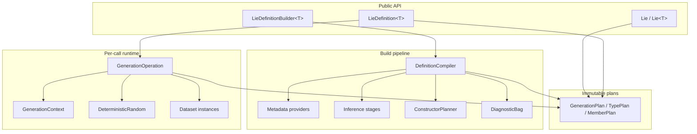
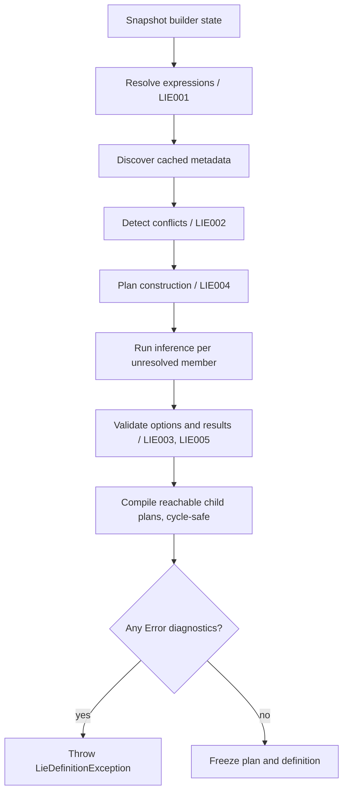

# Munchausen Contributor Handbook

This is the sole canonical technical and contributor handbook for Munchausen.
It defines the shipped v1.0 Foundation contract, the architecture that
implements it, and the rules for maintaining it.

> **Project status:** v1.0 Foundation is the shipped contract described here.
> Features listed in the roadmap appendix are not shipped and are not part of
> the compiled public surface.

## Table of Contents

- [How to Read This Handbook](#how-to-read-this-handbook)
- [Product and Release Boundary](#product-and-release-boundary)
- [Contributor Guide](#contributor-guide)
- [v1.0 Public API Reference](#v10-public-api-reference)
- [v1.0 Behavioral Contracts](#v10-behavioral-contracts)
- [Inference Catalog](#inference-catalog)
- [Dataset Reference](#dataset-reference)
- [Internal Architecture](#internal-architecture)
- [Testing and Release Gates](#testing-and-release-gates)
- [Parity Checklist](#parity-checklist)
- [Roadmap Appendix](#roadmap-appendix)

## How to Read This Handbook

The audience is contributors implementing, reviewing, testing, or extending
Munchausen, plus consumers who need an authoritative description of v1.0
behavior.

For a runnable, copy-pasteable tour of every v1.0 feature, see the
[Examples cookbook](EXAMPLES.md) and the `examples/Munchausen.Examples` project.

Labels have precise meanings:

- **Contract:** shipped v1.0 behavior or public API. Changes require normal
  compatibility review and may require a new minor or major version.
- **Implementation Detail:** the required v1.0 implementation design. It may
  change only when the resulting behavior, determinism, performance, and
  maintenance properties remain compliant.
- **Roadmap:** planned but not shipped. Roadmap names and behavior are not
  available APIs.

Terminology:

- **Automatic path:** `Lie<T>.Generate(...)`, which infers an immutable default
  plan and is permanently non-configurable.
- **Builder:** mutable, non-thread-safe `LieDefinitionBuilder<T>`.
- **Definition:** immutable, reusable, thread-safe `LieDefinition<T>`.
- **Generation operation:** all state owned by one public `Generate(...)` call.
- **Plan:** the immutable compiled representation executed during generation.
- **Semantic inference:** selecting a generator from member names, containing
  model hints, and value type.
- **Type inference:** selecting a generator from the value type after no
  semantic candidate survives.
- **Reference time:** the single timestamp captured or configured for one
  generation operation.

## Product and Release Boundary

### Product Model

**Contract:** Munchausen is an inference-first mock-data generator for .NET
objects. Given a model type, it resolves values in this order:

1. Explicit user configuration.
2. Property names and the containing model.
3. Property types and nullability.
4. Nested-object or collection generation.
5. Safe fallback behavior.

Users configure values only when inferred results are insufficient.

### Supported Platform

**Contract:** v1.0 targets `net8.0`. There is no `netstandard2.0` target.
`TimeProvider`, `DateOnly`, `TimeOnly`, nullable-reference metadata, and
required-member metadata are part of the platform floor.

Every public type lives in the root `Munchausen` namespace. Internal types
live in `Munchausen.<Area>` namespaces matching their ownership area.

### Shipped v1.0 Boundary

**Contract:** v1.0 ships:

- Automatic and explicitly defined generation.
- Explicit member values, generators, derivations, ignore, and preserve rules.
- Explicit construction, seeds, generation defaults, and immutable definitions.
- Constructor inference, nested objects, supported collections, cycles, depth,
  cancellation, and fixed reference time.
- Built-in semantic and type inference.
- Built-in datasets, including public `VehicleData` and `CommerceData` through
  `Dataset<TDataset>()`.
- Structured exceptions, diagnostics, and explainability.

**Roadmap:** composition, constraints, configurable locale, custom inference,
custom datasets, lifecycle hooks, validation, uniqueness, fields/member
filters, streaming, tolerant batches, data packs, dependency injection, async
generation, conditional blocks, advanced distributions, random polymorphism,
relationship reuse, private-member mutation, and Native AOT guarantees are not
shipped in v1.0.

### Core Invariants

**Contract:**

- Automatic inference is always active unless an explicit v1.0 rule overrides
  it.
- The automatic path is non-configurable; only definitions customize behavior.
- Builders are mutable and not thread-safe.
- Built definitions are immutable, reusable, and thread-safe.
- Definitions are isolated and can coexist for the same model type.
- `Build()` eagerly validates and compiles the complete reachable plan.
- Generation performs no expression parsing, constructor discovery, inference
  resolution, or repeated reflection.
- Seeded generation is reproducible within the documented compatibility
  boundary.
- Unseeded generation produces new random sequences.
- All mutable state belongs to one generation operation.
- Process-wide caches contain immutable metadata or plans only.
- Nested objects and supported collections generate automatically.
- Reference cycles and maximum depth terminate safely or throw according to
  configuration.
- Nullable members generate non-null values by default.
- Constructors are inferred unless `ConstructWith(...)` is configured.
- Diagnostic codes are never reused or renumbered.

### Compatibility Boundary

**Contract:** seeded output is reproducible only when the model, definition,
generation method, requested count, and Munchausen major/minor version are
unchanged. Semantic catalog or traversal-order improvements may change output
in a minor version. Consumers needing byte-stable output across upgrades must
pin the minor version or configure affected members explicitly.

Surface evolution is additive:

- Later public members are added in minor versions, never exposed as stubs
  before they ship.
- `GenerationOptions` and `GenerationDefaults` grow through new `init`
  properties, not constructor or existing-method signature changes.
- Enums may gain members in minor versions; consumer switches should handle
  unknown values.
- Diagnostic codes are never reused or renumbered.

## Contributor Guide

### Authority and Change Control

This handbook is the authority for public contracts, architecture, datasets,
inference tables, maintenance policy, and release gates. Do not invent a
public API, diagnostic, inference row, dataset member, or seeded-output change
that is not specified here. Escalate contradictions before implementation.

**Contract:** the public surface is locked to the v1.0 listings in this
handbook. A public-surface analyzer failure is fixed in code, not by casually
editing the shipped-surface baseline.

### Expected Repository Layout

**Implementation Detail:**

```text
munchausen/
  src/
    Munchausen/
      Lie.cs
      LieOfT.cs
      LieDefinitionBuilder.cs
      LieDefinition.cs
      Options/
      Builder/
      Metadata/
      Compilation/
      Inference/
      Runtime/
      Datasets/
      Diagnostics/
      Explain/
  tests/
    Munchausen.Tests/
    Munchausen.AcceptanceTests/
    Munchausen.DeterminismTests/
    Munchausen.Benchmarks/
```

### Coding Standards

**Implementation Detail:**

- Enable nullable reference types.
- Use file-scoped namespaces.
- Make types `sealed` by default and `internal` by default.
- Put public types only in the root `Munchausen` namespace.
- Treat warnings as errors.
- Generate XML documentation and treat CS1591 as an error.
- Give every public member XML documentation when it is introduced.
- Use xUnit for tests and BenchmarkDotNet for benchmarks.
- Do not add a source-package dependency without design review.
- Keep changes scoped; do not opportunistically refactor unrelated areas.

### Public-Surface Policy

**Contract:**

- Track the shipped surface with
  `Microsoft.CodeAnalysis.PublicApiAnalyzers` and `PublicAPI.Shipped.txt`.
- Every public member carries XML documentation.
- Builder-method documentation names the diagnostic codes the method may
  cause `Build()` to emit.
- `Ignore` and `Preserve` documentation opens by contrasting the two.
- New public APIs require an explicit compatibility decision.
- `VehicleData` and `CommerceData` are public datasets even though they are
  accessed through `GenerationContext.Dataset<TDataset>()`.

### Golden-File Policy

**Contract:** golden seeded outputs and PRNG vectors are append-only fixtures.
Never regenerate them merely to make a failing test pass. A failing golden
means the code is wrong or a seeded-output break has been found. An intentional
break requires an explicit minor-version decision recorded with the change.

### Maintenance Workflow

Contributors maintain the system in dependency order:

1. Preserve the determinism core and published vectors.
2. Preserve metadata ordering, nullability, required-member detection, and
   accessor behavior.
3. Preserve builder capture and expression-resolution rules.
4. Keep inference tables and structural classification synchronized with this
   handbook.
5. Keep compilation eager and diagnostic-rich.
6. Preserve runtime traversal, wrapping, cancellation, cycle, and depth rules.
7. Keep dataset surfaces and fictional-safe guarantees exact.
8. Keep explainability, automatic-path caching, public-surface baselines,
   acceptance tests, benchmarks, and final goldens green.

Before declaring a change complete, run `dotnet build` and `dotnet test`, with
warnings treated as errors. Review anything affecting public API, diagnostics,
catalog contents, traversal order, PRNG consumption, or seeded output
explicitly.

## v1.0 Public API Reference

### Complete Foundation Surface

**Contract:** the following is the complete v1.0 Foundation public surface.
Types and members in the roadmap appendix do not exist in the v1.0 compiled
surface.

```csharp
public static class Lie<T>
{
    public static T Generate(
        GenerationOptions? options = null,
        CancellationToken cancellationToken = default);

    public static IReadOnlyList<T> Generate(
        int count,
        GenerationOptions? options = null,
        CancellationToken cancellationToken = default);
}

public static class Lie
{
    public static LieDefinitionBuilder<T> Define<T>();
}

public sealed class LieDefinitionBuilder<T>
{
    public LieDefinitionBuilder<T> WithName(string name);

    public LieDefinitionBuilder<T> With<TProperty>(
        Expression<Func<T, TProperty>> property,
        TProperty value);

    public LieDefinitionBuilder<T> With<TProperty>(
        Expression<Func<T, TProperty>> property,
        Func<GenerationContext, TProperty> generator);

    public LieDefinitionBuilder<T> Derive<TProperty>(
        Expression<Func<T, TProperty>> property,
        Func<GenerationContext, T, TProperty> generator);

    public LieDefinitionBuilder<T> Ignore<TProperty>(
        Expression<Func<T, TProperty>> property);

    public LieDefinitionBuilder<T> Preserve<TProperty>(
        Expression<Func<T, TProperty>> property);

    public LieDefinitionBuilder<T> ConstructWith(
        Func<GenerationContext, T> constructor);

    public LieDefinitionBuilder<T> WithSeed(int seed);
    public LieDefinitionBuilder<T> WithDefaults(GenerationDefaults defaults);

    public LieDefinition<T> Build();
}

public sealed class LieDefinition<T>
{
    public string? Name { get; }

    public T Generate(
        GenerationOptions? options = null,
        CancellationToken cancellationToken = default);

    public IReadOnlyList<T> Generate(
        int count,
        GenerationOptions? options = null,
        CancellationToken cancellationToken = default);

    public InferenceReport Explain();
}

public sealed record GenerationOptions
{
    public int? Seed { get; init; }
    public DateTimeOffset? ReferenceTime { get; init; }
    public TimeProvider? TimeProvider { get; init; }
}

public sealed record GenerationDefaults
{
    public int? Seed { get; init; }
    public DateTimeOffset? ReferenceTime { get; init; }
    public int? MaximumDepth { get; init; }
    public CycleBehavior? CycleBehavior { get; init; }
    public SemanticInferenceMode? SemanticInference { get; init; }
}

public readonly record struct CollectionSize
{
    public static CollectionSize Exactly(int count);
    public static CollectionSize Between(int minInclusive, int maxInclusive);

    public int MinCount { get; }
    public int MaxCount { get; }
}

[AttributeUsage(AttributeTargets.Constructor)]
public sealed class LieConstructorAttribute : Attribute;

public sealed class GenerationContext
{
    public long Index { get; }
    public string Locale { get; }
    public string MemberPath { get; }

    public TModel Generate<TModel>();
    public IReadOnlyList<TModel> GenerateMany<TModel>(int count);
    public TModel Generate<TModel>(LieDefinition<TModel> definition);
    public IReadOnlyList<TModel> GenerateMany<TModel>(
        LieDefinition<TModel> definition,
        int count);

    public TDataset Dataset<TDataset>();

    public RandomData Random { get; }
    public DateData Date { get; }
    public NameData Name { get; }
    public InternetData Internet { get; }
    public AddressData Address { get; }
    public LoremData Lorem { get; }
}

public sealed class RandomData
{
    public bool Bool(double probability = 0.5);

    public int Int(
        int minInclusive = int.MinValue,
        int maxInclusive = int.MaxValue);

    public long Long(
        long minInclusive = long.MinValue,
        long maxInclusive = long.MaxValue);

    public decimal Decimal(
        decimal minInclusive,
        decimal maxInclusive,
        int decimals = 2);

    public double Double(
        double minInclusive = 0,
        double maxInclusive = 1);

    public string String(int length);
    public string AlphaNumeric(int length);
    public byte[] Bytes(int length);

    public Guid Guid();

    public T Pick<T>(IReadOnlyList<T> values);
    public T Pick<T>(params T[] values);
    public T Weighted<T>(IReadOnlyList<WeightedValue<T>> values);
    public IReadOnlyList<T> Sample<T>(
        IReadOnlyList<T> values,
        int count,
        bool replacement = false);

    public TEnum Enum<TEnum>() where TEnum : struct, Enum;
}

public readonly record struct WeightedValue<T>(T Value, double Weight);

public sealed class NameData
{
    public string First();
    public string Last();
    public string FullName();
}

public sealed class InternetData
{
    public string Email();
    public string Email(string firstName, string lastName);
    public string UserName();
    public string DomainName();
    public string Url();
    public string IpAddress();
}

public sealed class AddressData
{
    public string StreetAddress();
    public string City();
    public string State();
    public string PostalCode();
    public string Country();
    public string CountryCode();
    public double Latitude();
    public double Longitude();
}

public sealed class DateData
{
    public DateTimeOffset ReferenceTime { get; }

    public DateTimeOffset Past(int years = 10);
    public DateTimeOffset Recent(int days = 30);
    public DateTimeOffset Soon(int days = 30);
    public DateTimeOffset Future(int years = 10);

    public DateTimeOffset Between(
        DateTimeOffset minInclusive,
        DateTimeOffset maxInclusive);

    public DateTimeOffset BirthDate(
        int minAgeInclusive = 18,
        int maxAgeInclusive = 80);
}

public sealed class LoremData
{
    public string Word();
    public string Words(int count);
    public string Sentence();
    public string Paragraph();
    public string Text(int maxLengthInclusive);
}

public sealed class VehicleData
{
    public string Make();
    public string Model();
    public string Model(string make);
    public int Year();
    public string Vin();
}

public sealed class CommerceData
{
    public decimal Price(
        decimal minInclusive = 1m,
        decimal maxInclusive = 1000m,
        int decimals = 2);

    public string ProductName();
    public string Category();
    public string Sku();
    public string CurrencyCode();
}

public enum InferenceConfidence
{
    High,
    Medium,
    Low
}

public enum SemanticInferenceMode
{
    Conservative,
    Balanced,
    Aggressive,
    Disabled
}

public enum CycleBehavior
{
    Terminate,
    Throw
}

public abstract class LieException : Exception;

public sealed class LieDefinitionException : LieException
{
    public IReadOnlyList<LieDiagnostic> Diagnostics { get; }
}

public sealed class LieGenerationException : LieException
{
    public Type ModelType { get; }
    public string MemberPath { get; }
    public long GenerationIndex { get; }
    public GenerationPhase Phase { get; }
}

public enum GenerationPhase
{
    Construction,
    BeforeGenerateHook,
    MemberPopulation,
    Derivation,
    AfterGenerateHook,
    Validation,
    UniquenessCommit
}

public sealed record LieDiagnostic(
    string Code,
    LieDiagnosticSeverity Severity,
    string Message,
    Type? ModelType = null,
    string? MemberPath = null);

public enum LieDiagnosticSeverity
{
    Info,
    Warning,
    Error
}

public sealed class InferenceReport
{
    public string? DefinitionName { get; }
    public Type ModelType { get; }
    public string Locale { get; }
    public bool IsComplete { get; }
    public IReadOnlyList<MemberInferenceReport> Members { get; }
    public IReadOnlyList<LieDiagnostic> Diagnostics { get; }

    public string ToText();
}

public sealed class MemberInferenceReport
{
    public string MemberPath { get; }
    public InferenceSource Source { get; }
    public string Generator { get; }
    public InferenceConfidence? Confidence { get; }
    public string? OriginDefinition { get; }
    public int? DerivationOrder { get; }
    public IReadOnlyList<string> OverriddenRules { get; }
}

public enum InferenceSource
{
    Explicit,
    Derived,
    Preserved,
    Ignored,
    Attribute,
    CustomProvider,
    Semantic,
    Type,
    ChildDefinition,
    Unsupported
}
```

`CollectionSize` is present in the v1.0 public surface for additive
compatibility, but v1.0 exposes no builder/default property that consumes it.
`Exactly(...)` and `Between(...)` validate their arguments; `MinCount` and
`MaxCount` expose the resulting inclusive range.
`GenerationPhase` and `InferenceSource` include values reserved for later
additive behavior; their presence does not mean the associated roadmap
feature is shipped.

### Automatic Generation

**Contract:**

```csharp
Car car = Lie<Car>.Generate();
IReadOnlyList<Car> cars = Lie<Car>.Generate(100);
```

`Lie<T>` always means "infer how to generate instances of `T`." The automatic
path cannot be configured, which makes its process-global immutable plan cache
safe.

### Defined Generation

**Contract:**

```csharp
var recentCars = Lie.Define<Car>()
    .With(car => car.Year, data => data.Random.Int(2020, 2026))
    .Ignore(car => car.InternalCode)
    .Build();

Car car = recentCars.Generate();
IReadOnlyList<Car> cars = recentCars.Generate(100);
```

`Lie.Define<T>()` creates an isolated builder. `Build()` produces an immutable
definition without changing `Lie<T>` or any other definition. A builder may be
used again after `Build()`; every call compiles a snapshot.

### Rule Semantics

**Contract:**

- `With(member, value)` assigns a constant.
- `With(member, generator)` evaluates a context-based generator during member
  population.
- A later `With` for the same member overrides an earlier `With`; overridden
  rules remain visible to `Explain()`.
- `Derive(member, generator)` runs after normal member population and receives
  the generated object.
- `Ignore(member)` and `Preserve(member)` both prevent Munchausen from writing
  the member.
- `Ignore` accepts the construction-time value and never warns.
- `Preserve` declares that a constructor or initializer supplies a meaningful
  value. Best-effort analysis emits LIE011 when the selected constructor may
  never assign it.
- `Ignore` and `Preserve` appear as distinct explain sources.
- `ConstructWith(...)` overrides inferred construction.
- `WithName(...)` assigns an optional diagnostic name only; names need not be
  unique and do not affect generation. Empty or whitespace-only names are
  rejected with LIE005.

Member expressions must be exactly `x => x.Member`, optionally through the
compiler-generated `Convert`/`ConvertChecked` for a boxed value type. Method
calls, nested paths, indexers, closures, and casts of the parameter are invalid
and produce LIE001.

### Defaults and Per-Call Options

**Contract:** configuration resolves from lowest to highest precedence:

1. Library defaults.
2. Definition-level `GenerationDefaults`, merged in configuration order.
3. Per-call `GenerationOptions`.

`WithDefaults(defaults)` applies each non-null property at that point in the
builder chain. Null means no opinion. The last write per property wins.
`WithSeed(seed)` is equivalent to applying a defaults record containing that
seed. Per-call seed and reference time override definition defaults.

`Build()` validates configured values with LIE005.

### Generation Context

**Contract:** explicit rules receive the same operation-scoped capabilities
used by inference. `Index` is the current root-object index. `MemberPath` is
the active member path. `Locale` is the stable built-in `en` locale in v1.0.

`Generate<TModel>()` and `GenerateMany<TModel>()` use automatic nested
inference. Overloads receiving a `LieDefinition<TModel>` use that definition
explicitly. `Dataset<TDataset>()` resolves built-in datasets, including the
public `VehicleData` and `CommerceData`.

**Implementation Detail:** one `GenerationContext` facade exists per
generation operation. It is valid only during the call that supplied it;
capturing it and reading it later observes the operation's final state.

### Random Helpers

**Contract:**

- Numeric minimum and maximum bounds are inclusive.
- Boolean probability is in `[0, 1]`.
- Weighted values require finite positive weights and are normalized; weights
  need not total one.
- Sampling explicitly selects replacement behavior.
- Seeded generation reproduces helper results.
- `String(length)` produces printable characters.
- `AlphaNumeric(length)` produces letters and digits.
- `Guid()` and `Bytes(length)` draw from the operation PRNG.
- `Enum<TEnum>()` selects from defined enum values.

## v1.0 Behavioral Contracts

### Inference Precedence

**Contract:** v1.0 resolves each eligible member in this order:

1. Explicit `With`, `Derive`, `Ignore`, or `Preserve`.
2. Built-in semantic inference from member name, containing model, and type.
3. Built-in type inference.
4. Nested-object or supported-collection generation.
5. Unsupported-member fallback, which leaves the member untouched and reports
   it through `Explain()`.

Automatic inference remains active for every member not explicitly resolved.

### Build Validation

**Contract:** `Build()` eagerly rejects every detectable structural error and
aggregates diagnostics rather than stopping at the first error. Invalid cases
include:

- Conflicting rules for one member.
- Invalid or unsupported member expressions.
- Invalid constructor configuration.
- Invalid depth or other v1.0 options.
- A model that cannot be constructed.
- An unresolved required member.

Unsupported optional members are preserved by default and included in
`Explain()`.

Conflict rules:

- Later `With` overrides earlier `With`.
- `With` combined with `Ignore` or `Preserve` is LIE002.
- `Ignore` combined with `Preserve` is LIE002.
- `Derive` coexists with no other rule on the same member.
- Two `Derive` rules on the same member are LIE002.

### Member Selection

**Contract:** automatic population targets public instance properties with
public setters or init setters. Static members, indexers, fields, private
members, and read-only properties are excluded. Read-only and unsupported
members remain unchanged and appear in `Explain()`. Explicit rules may target
only eligible writable properties.

### Constructors and Immutable Models

**Contract:** constructor selection follows this order:

1. Use the single public constructor marked `[LieConstructor]`.
2. Otherwise, use the public constructor with the most resolvable parameters.
3. Prefer a parameterless constructor only when it is equally resolvable.
4. Fail with LIE004 when multiple constructors are equally valid and no
   deterministic winner exists.
5. `ConstructWith(...)` overrides automatic selection.

Constructor parameters use the same semantic and type inference pipeline as
properties. Constructor-assigned read-only properties remain unchanged.
Init-only and writable properties may be populated after construction where
the runtime supports it. `Preserve(...)` prevents overwriting constructor or
initializer values. `Derive(...)` requires a writable target.

User failures inside `ConstructWith(...)` are generation-time failures with
`GenerationPhase.Construction`.

### Root Types and Nullability

**Contract:** `Lie<T>` and `Lie.Define<T>()` are unconstrained. Primitive,
string, and `Nullable<T>` roots generate through type inference. Nullable roots
generate non-null because v1.0 has no root null-probability feature.

Nullable members are populated with non-null values by default. Nullability
permits null but does not request it. Required members include non-nullable
value types, non-nullable reference types, C# `required` members, and members
marked `[Required]`. If an explicit generator returns null for a required
member, generation fails contextually.

### Collections and Current Limitations

**Contract:** inferred collection properties normally generate one to three
elements. Collection elements are nested objects but the collection container
does not add a graph-depth level. `byte[]` is a scalar default of 16 random
bytes, not a collection.

**Implementation Detail:** v1.0 supports these declared shapes:

- `T[]`
- `List<T>`
- `IList<T>`
- `ICollection<T>`
- `IEnumerable<T>`
- `IReadOnlyList<T>`
- `IReadOnlyCollection<T>`
- `Dictionary<TKey, TValue>` and dictionary interfaces

**Current v1.0 limitation:** dictionary shapes are recognized and materialized
as empty dictionaries; automatic key/value synthesis is not shipped.
Unsupported or custom collection types remain unchanged and require an
explicit `With(...)` rule.

### Graph Depth and Cycles

**Contract:** root objects have depth zero. Each nested object increases depth
by one. The default maximum depth is three. Cycles are detected from the
active member path; repeated sibling types are valid.

Default `CycleBehavior` is `Terminate`:

- Nullable references terminate as null.
- Collections terminate as empty collections.
- Optional writable members may retain their existing value.

`CycleBehavior.Throw` raises a contextual `LieGenerationException` when a
cycle or maximum depth is reached. Munchausen never automatically reuses an
ancestor instance.

### Deterministic Seeding

**Contract:** every `Generate(...)` call starts a fresh operation. A seeded
definition produces equivalent output on repeated calls with the same method
and count. Per-call seed overrides definition seed. Random, sequence position,
datasets, graph traversal, and other operation state never leak between calls.
Built definitions remain stateless and safe for concurrent calls.

**Implementation Detail:** Munchausen owns its deterministic PRNG:

- SplitMix64 expands the user's `int` seed.
- xoshiro256** produces the operation stream.
- Unseeded operations draw one 64-bit seed from `Random.Shared`, in exactly one
  place.
- All later randomness uses the owned operation stream.
- Randomness is consumed in deterministic traversal order: members in
  `MetadataToken` order, collection elements by index, and derivations by
  registration order.

No other source code may use `System.Random`.

### Reference Time

**Contract:** one reference time is resolved and held fixed for an entire
generation operation:

1. `GenerationOptions.ReferenceTime`.
2. `GenerationDefaults.ReferenceTime`.
3. `GenerationOptions.TimeProvider.GetUtcNow()`, read once.
4. UTC time captured once when generation begins.

Date inference preserves the declared `DateTime`, `DateTimeOffset`, `DateOnly`,
`TimeOnly`, or `TimeSpan` type. Generated `DateTimeOffset` values use UTC;
generated `DateTime` values use `DateTimeKind.Utc`. Date ranges are inclusive.
Host-machine local time zones are never inferred.

### Cancellation

**Contract:** cancellation tokens are trailing parameters on generation
methods. Cancellation is checked before each root object, collection-element
generation, and nested-object generation, and between derivations.
Cancellation throws standard `OperationCanceledException`, which is never
wrapped as a generation failure.

### Exceptions and Diagnostics

**Contract:** `Build()` throws `LieDefinitionException` and includes every
detectable error in `Diagnostics`. Its `Message` is the first Error diagnostic,
prefixed with the model type and suffixed with the remaining error count:

```text
Definition for Car is invalid: Conflicting member rules for Car.Year
(LIE002). (2 more errors; see Diagnostics.)
```

Runtime failures throw `LieGenerationException` with model type, member path,
root generation index, and generation phase. User-code and runtime exceptions
are wrapped once and retained as `InnerException`. `OperationCanceledException`
passes through unchanged.

The stable diagnostic registry is:

| Code | Meaning | Severity and v1.0 use |
|---|---|---|
| LIE001 | Invalid member expression | Error; active in v1.0 |
| LIE002 | Conflicting member rules | Error; active in v1.0 |
| LIE003 | Unresolved required member | Error; active in v1.0 |
| LIE004 | Ambiguous constructor | Error; active in v1.0 |
| LIE005 | Invalid option | Error; active in v1.0 |
| LIE006 | Unknown locale | Error; reserved for roadmap locale configuration |
| LIE007 | Data-pack conflict | Error; reserved for roadmap data packs |
| LIE008 | Unsupported constraint | Warning, or Error under a roadmap completeness mode |
| LIE009 | Self-type child definition | Info; reserved for roadmap composition |
| LIE010 | Unique value exhaustion | Generation-time Error; reserved for roadmap uniqueness |
| LIE011 | Preserve target may never be assigned | Warning; best-effort and active in v1.0 |

Codes reserved for roadmap features remain in the stable registry but do not
make those features shipped.

### Explainability

**Contract:** `Explain()` inspects the compiled plan without generating values.
It reports definition name, model type, stable `en` locale, completeness,
members, diagnostics, selected source, generator, confidence, origin,
derivation order, and overridden rules.

Semantic entries report matching reason, selected confidence, rejected
candidates, and fallback decisions. Unsupported members appear in the report.
User delegates are identified by rule and target member, not decompiled.
`ToText()` is a deterministic human-readable renderer; structured report
objects are primary.

Example:

```text
Car.Id    -> Random.Guid       [type]
Car.Make  -> Vehicle.Make      [property name + model]
Car.Model -> Vehicle.Model     [property name + model]
Car.Year  -> Vehicle.Year      [property name + model]
Car.Owner -> Owner definition  [nested object]
```

## Inference Catalog

### Matching Rules

**Contract:**

1. Normalize member names by splitting case transitions, underscores, and
   hyphens; lowercase; then join. `FirstName`, `first_name`, and
   `FIRST-NAME` normalize to `firstname`.
2. Normalize model hints the same way and match them by substring against the
   containing model's normalized type name. `PremiumCustomerDto` matches
   `customer`.
3. A candidate matches only when the member value type equals the candidate
   value type after unwrapping `Nullable<T>`.
4. Assign confidence:
   - Exact normalized-name match plus a matching model hint: **High**.
   - Exact match and no model hints: listed base confidence.
   - Exact match with model hints but no hint match: one level below base,
     never below Low.
   - Suffix match: one level below the exact-match result.
5. Highest confidence wins; ties resolve by table order. The selected semantic
   mode then filters candidates. Rejected candidates are recorded by
   `Explain()`.

Semantic modes:

- `Conservative`: High only.
- `Balanced`: High and Medium; v1.0 default.
- `Aggressive`: High, Medium, and Low.
- `Disabled`: skip semantic matching.

**Important vehicle exception:** the vehicle rows define row-specific no-hint
behavior that overrides the general confidence rule. `make` and `model` become
Low without a vehicle hint. `year` without a vehicle hint uses the internal
recent-year generator at Medium confidence.

### Semantic Candidate Table

Value type is `string` unless the row states otherwise.

#### Person

| Names (normalized) | Model hints | Generator | Base |
|---|---|---|---|
| firstname, givenname, forename | none | Name.First | High |
| lastname, surname, familyname | none | Name.Last | High |
| fullname | none | Name.FullName | High |
| name | person, user, customer, employee, contact, owner, author, member, account | Name.FullName | High; without a hint match: Medium |
| name | product, item, sku, article | Commerce.ProductName | High; without a hint match: Medium |
| age (`int`) | none | `int` 18-80 inclusive | High |

#### Contact and Internet

| Names | Model hints | Generator | Base |
|---|---|---|---|
| email, emailaddress, mail | none | Internet.Email | High |
| phone, phonenumber, telephone, mobile, cellphone | none | internal phone | High |
| username, login, handle, nickname | none | Internet.UserName | High |
| url, website, homepage, link | none | Internet.Url | High |
| domain, domainname, hostname | none | Internet.DomainName | High |
| ipaddress, ip | none | Internet.IpAddress | Medium |

#### Address

| Names | Model hints | Generator | Base |
|---|---|---|---|
| streetaddress, street, addressline1, address | none | Address.StreetAddress | High; bare `address`: Medium |
| city, town | none | Address.City | High |
| state, province, region | none | Address.State | Medium |
| postalcode, zipcode, zip, postcode | none | Address.PostalCode | High |
| country, countryname | none | Address.Country | High |
| countrycode, isocountrycode | none | Address.CountryCode | High |
| latitude, lat (`double`) | none | Address.Latitude | High |
| longitude, lng, lon (`double`) | none | Address.Longitude | High |

#### Dates

Value types: `DateTime`, `DateTimeOffset`, and `DateOnly`.

| Names | Generator | Base |
|---|---|---|
| createdat, createdon, created, creationdate | Date.Past(2) | High |
| updatedat, modifiedat, updatedon, lastmodified | Date.Recent(30) | High |
| deletedat, removedat | Date.Recent(30) | High |
| birthdate, dateofbirth, dob, birthday | Date.BirthDate() | High |
| expiresat, expirydate, expirationdate, validuntil | Date.Future(2) | High |
| duedate, dueat, deadline | Date.Soon(60) | High |
| startdate, startedat, begindate | Date.Past(1) | Medium |
| enddate, endedat, finishdate | Date.Future(1) | Medium |

#### Commerce and Identifiers

| Names | Model hints | Generator | Base |
|---|---|---|---|
| price, unitprice, listprice (`decimal`) | none | Commerce.Price() | High |
| cost, amount, total, subtotal (`decimal`) | none | Commerce.Price() | Medium |
| sku, productcode | none | Commerce.Sku | High |
| category, department | product, item, commerce, order | Commerce.Category | Medium |
| currency, currencycode | none | Commerce.CurrencyCode | High |
| id, identifier | none | internal guid-string | Medium |
| code, referencecode, reference | none | internal short-code | Low |
| quantity, count, qty (`int`) | none | `int` 1-100 | Medium |

#### Vehicle

| Names | Model hints | Generator | Base |
|---|---|---|---|
| make, manufacturer | car, vehicle, auto, truck, fleet | Vehicle.Make | High with hint; no hint: Low |
| model | car, vehicle, auto, truck, fleet | Vehicle.Model | High with hint; no hint: Low |
| year (`int`) | car, vehicle, auto, truck, fleet | Vehicle.Year | High with hint; no hint: internal recent-year, Medium |
| vin | none | Vehicle.Vin | High |

#### Text

| Names | Generator | Base |
|---|---|---|
| description, summary, details | Lorem.Paragraph | Medium |
| notes, comment, comments, remarks | Lorem.Sentence | Medium |
| title, subject, heading | Lorem.Words(3) | Medium |
| bio, about, biography | Lorem.Paragraph | Medium |

### Type Defaults

Applied when no semantic candidate survives. All ranges are inclusive.

| Type | Default generation |
|---|---|
| `bool` | 50/50 |
| `byte` | 0-255 |
| `sbyte` | 0-100 |
| `short` / `ushort` | 0-1,000 |
| `int` / `uint` | 0-10,000 |
| `long` / `ulong` | 0-1,000,000 |
| `float` / `double` | 0-10,000, round-tripped to 4 decimals |
| `decimal` | 0-10,000, 2 decimals |
| `char` | `'a'`-`'z'` |
| `string` | `Lorem.Words(2)` |
| `Guid` | `Random.Guid` |
| `DateTime` / `DateTimeOffset` | `Date.Recent(365)`, UTC |
| `DateOnly` | date part of `Date.Recent(365)` |
| `TimeOnly` | uniform over the day |
| `TimeSpan` | uniform 0-24 hours, second precision |
| enum | uniform over defined values; `[Flags]` draws one defined value |
| `Uri` | absolute HTTPS URI from `Internet.Url` |
| `byte[]` | 16 random bytes; scalar special case |
| `Nullable<T>` | underlying type default; non-null in v1.0 |
| `nint` / `nuint` / `Half` / `Int128` / `UInt128` | unsupported; fallback and explain diagnostic |

### Catalog Governance

**Implementation Detail:** semantic candidates and type defaults each live in
one ordered internal table. Unit tests assert that the implementation matches
every row, name, hint, type, and confidence in this handbook. Catalog changes
update the handbook and goldens together and are treated as seeded-output
changes.

## Dataset Reference

### Shared Dataset Contracts

**Contract:**

- Every v1.0 dataset method draws exclusively from the operation's
  deterministic stream.
- No dataset method reads the clock. Time-relative methods use the operation's
  resolved reference time.
- Bounds are inclusive and parameters use `minInclusive`/`maxInclusive`.
- Invalid arguments throw standard `ArgumentOutOfRangeException` or
  `ArgumentException`. When called in a rule, the rule boundary wraps the
  failure once as `LieGenerationException`.
- The built-in locale is English (`en`).
- Data-table values may grow or change in minor versions.
- Built-in dataset instances are created once per generation operation and
  shared by all objects in that operation.
- Concurrent and later operations receive isolated dataset instances.

Fictional-safe guarantees:

- Email domains use RFC 2606 reserved `example.com`, `example.org`, or
  `example.net`.
- Internal phone generators use the 555-01xx fictional range.
- VINs are structurally valid but not manufacturer-registered.
- Generated IP addresses are documented as fictional.

`Random`, `Date`, `Name`, `Internet`, `Address`, and `Lorem` are first-class
context properties because they are domain-neutral and used by common built-in
semantic inference. Public domain datasets `VehicleData` and `CommerceData`
ship in the core package and are accessed through:

```csharp
data.Dataset<VehicleData>()
data.Dataset<CommerceData>()
```

### NameData

**Contract:**

- `First()` returns an English first name.
- `Last()` returns an English last name.
- `FullName()` composes one `First()` draw and one `Last()` draw, in that
  order, as `"First Last"`.

Honorifics, suffixes, middle names, and gendered variants are not shipped.

### InternetData

**Contract:**

- `Email()` draws internal name parts and derives a fictional-safe address.
- `Email(firstName, lastName)` derives the local part from supplied names.
- Email local parts are lowercase ASCII without whitespace; separator style
  varies.
- `UserName()` is lowercase ASCII, 5-16 characters, without whitespace.
- `DomainName()` returns a bare registrable name such as
  `lorem-systems.example`.
- `Url()` returns an absolute HTTPS URL using a generated domain.
- `IpAddress()` returns a valid IPv4 dotted-quad string, avoiding
  reserved/special ranges other than TEST-NET blocks.

### AddressData

**Contract:**

- `StreetAddress()` returns a form such as `"1742 Maple Street"`.
- `State()` returns a full name such as `"Oregon"`.
- `PostalCode()` returns a five-digit numeric code in `en`.
- `Country()` returns an English short name.
- `CountryCode()` returns an ISO 3166-1 alpha-2 code.
- `Country()` and `CountryCode()` draw independently.
- `Latitude()` is uniform from -90 to 90 inclusive with six decimals.
- `Longitude()` is uniform from -180 to 180 inclusive with six decimals.

### DateData

**Contract:**

- `ReferenceTime` is the operation's fixed reference time.
- `Past(years)` is uniform in
  `[ReferenceTime - years, ReferenceTime]`.
- `Recent(days)` is uniform in
  `[ReferenceTime - days, ReferenceTime]`.
- `Soon(days)` is uniform in
  `[ReferenceTime, ReferenceTime + days]`.
- `Future(years)` is uniform in
  `[ReferenceTime, ReferenceTime + years]`.
- `Between(minInclusive, maxInclusive)` includes both bounds and requires
  `minInclusive <= maxInclusive`.
- `BirthDate(minAgeInclusive, maxAgeInclusive)` yields a date whose whole-year
  age at `ReferenceTime` is inside the inclusive range.
- `years` and `days` arguments must be positive.
- All returned `DateTimeOffset` values are UTC.

Conversion to other date/time member types belongs to type inference.

### LoremData

**Contract:**

- `Word()` draws classic lorem-style filler.
- `Words(count)` joins exactly `count` words with spaces.
- `Sentence()` returns 6-12 words, capitalized and period-terminated.
- `Paragraph()` returns 3-6 sentences.
- `Text(maxLengthInclusive)` returns a sentence stream that never exceeds the
  limit and never cuts a word; the minimum accepted limit is 1.
- Lorem output is not meaningful English and does not reuse name/address data.

### VehicleData

**Contract:** `VehicleData` is public and accessed through
`Dataset<VehicleData>()`.

- `Make()` returns a vehicle make.
- `Model()` returns any model from any make.
- `Model(make)` returns a model coherent with a known make; an unknown make
  falls back to a plausible generic model.
- `Year()` returns an integer from 1990 through reference year plus one.
- `Vin()` returns 17 characters, excludes I/O/Q, and has a valid check digit.

### CommerceData

**Contract:** `CommerceData` is public and accessed through
`Dataset<CommerceData>()`.

- `Price(minInclusive, maxInclusive, decimals)` requires
  `0 <= minInclusive <= maxInclusive` and `0 <= decimals <= 4`.
- Prices are rounded half-even to `decimals`.
- `ProductName()` composes adjective, material, and product noun.
- `Category()` returns a department/category noun.
- `Sku()` returns the `"ABC-12345"` pattern.
- `CurrencyCode()` returns an ISO 4217 alpha-3 code.

### Internal-Only Generators

**Implementation Detail:** these support semantic inference but are not public
dataset methods:

- Phone numbers in fictional 555-01xx forms.
- Guid-string identifiers.
- Short-code identifiers.
- Recent-year integers for non-vehicle `Year` members.

Promoting one to a public member is an API change.

## Internal Architecture

### Architectural Goals

**Implementation Detail:**

1. `Build()` performs all reflection, expression parsing, inference,
   constructor selection, and validation.
2. Definitions and everything they reference are deeply immutable after
   build.
3. Determinism uses an owned PRNG and defined traversal order.
4. Mutable state is operation-scoped; global caches contain immutable values.
5. Reflection and expression compilation are isolated behind replaceable
   metadata/accessor interfaces.
6. Future additive features attach to reserved internal slots without changing
   v1.0 behavior.

### Layering



Dependencies point downward. Plans reference nothing above them. Inference
produces plan entries and never references the runtime.

### Metadata

**Implementation Detail:** `IModelMetadataProvider` and
`IMemberAccessorFactory` isolate reflection and accessor creation. v1.0 ships
reflection metadata and compiled-expression accessors with a reflection-invoke
fallback when dynamic code is unavailable.

Metadata includes constructors, ordered members, writability, nullability,
required state, attributes, and compiled getters/setters. Members sort by
`MemberInfo.MetadataToken`; changing model declaration order may change seeded
output. Nullability uses `NullabilityInfoContext` and
`Nullable.GetUnderlyingType`. Required state is the union of C# `required` and
`[Required]`.

Immutable metadata/accessors are cached process-wide by type.

### Build Pipeline



All stages append to one `DiagnosticBag` and continue where meaningful so
every detectable build error is returned.

Reachable child plans compile in two phases. Phase one allocates type-plan
shells; phase two fills them. Recursive members point to an existing shell,
preventing infinite compilation. Graph-depth enforcement remains runtime work.

### Plan Model

**Implementation Detail:** a `GenerationPlan` holds the root plan, reachable
type plans, frozen defaults, optional definition name, and build diagnostics.
Each `TypePlan` holds construction, member population in deterministic order,
and derivations in registration order. Each `MemberPlan` holds metadata,
accessor, value source, and explain-report data.

Value sources are constants, compiled delegates, nested plans, collection
plans, or skipped markers. Typed user delegates adapt once at build time to a
uniform internal representation. Explain metadata lives on the plan so
`Explain()` is a pure plan walk.

### Runtime Traversal

**Implementation Detail:** one `GenerationOperation` owns the PRNG, fixed
reference time, cancellation token, immutable plan, current root index, active
path stack, context facade, and dataset instances.

For each root:

1. Check cancellation and construct.
2. Visit member plans in `MetadataToken` order, checking cancellation before
   nested and collection-element generation; evaluate and assign sources.
3. Execute derivations in registration order.
4. Return the completed root.

Skipped members are untouched. User delegates are wrapped exactly once with
the current model, path, index, and phase. Matching cancellation exceptions
pass through.

The active path stack tracks member and declared type. Cycle detection examines
the active chain, allowing repeated sibling types. On termination, nullable
references become null, collections become empty, and optional writable
members may remain untouched.

### Automatic Path and Caching

**Implementation Detail:** each closed `Lie<T>` owns a thread-safe lazy cached
automatic plan. Nested automatic type plans may be shared through a
process-wide `ConcurrentDictionary<Type, TypePlan>`. Automatic compilation
failures surface on first generation as `LieDefinitionException` and are
cached consistently by the lazy value.

Explicit definitions are independent and are not structurally deduplicated.
Seeds, reference time, datasets, and traversal state are never cached.

### Threading

**Contract and Implementation Detail:**

- Builders have no synchronization and are not thread-safe.
- Definitions, plans, metadata, and catalog tables are immutable and freely
  shared.
- A generation operation is confined to its calling thread.
- Concurrent generation uses separate calls on one shared definition, each
  owning an isolated operation.

### Performance Budget

**Implementation Detail:** v1.0 release targets, measured on a five-member
`Car` with one nested object:

- Simple `Build()`: under 5 ms cold and under 0.5 ms with warm metadata caches.
- Steady-state `Lie<Car>.Generate()`: under 2 microseconds per object, with no
  allocations beyond the generated graph and one operation header.
- `Generate(100_000)`: linear scaling and no per-object reflection.

Benchmarks cover build cost, graph depth, collection materialization, and PRNG
throughput.

### Known Implementation Constraints

**Implementation Detail:**

- Uniform internal value sources may box value-type members. A typed fast path
  is justified only by benchmark evidence.
- `MetadataToken` ordering is stable for a given compiled assembly but remains
  a compiler/runtime implementation detail. Replacing it would be a
  seeded-output change.
- The semantic table is a static immutable array; revisit its startup cost only
  if measured catalog growth requires it.
- The automatic path's lazy value caches compilation exceptions for the
  process lifetime. Explicit definitions bypass that cache.
- Reflection has a non-dynamic-code fallback, but Native AOT compatibility is
  not guaranteed in v1.0.
- Dictionary shapes materialize empty until key/value synthesis is designed
  and shipped.

## Testing and Release Gates

### Required Test Coverage

**Contract:**

- PRNG output matches published SplitMix64 and xoshiro256** vectors.
- Random helpers cover inclusive bounds, weighting, and sampling semantics.
- Metadata tests cover declaration order, nullability, required members,
  attributes, accessors, init-only behavior, and reflection fallback.
- Expression resolver tests cover accepted and rejected shapes with LIE001.
- Defaults tests cover per-property last-write and null-as-no-opinion.
- Inference tests cover normalization, confidence, modes, every catalog row,
  every type default, and structural classification.
- Compiler tests cover LIE001-LIE005, multi-error aggregation, exception
  message composition, constructor selection, records, and recursive plans.
- Runtime tests cover traversal order, cancellation, wrapped-once failures,
  cycles, depth, supported collection shapes, empty dictionaries, and seeded
  reproducibility.
- Dataset tests cover every method contract, bounds, fictional-safe formats,
  VIN check digit, lorem truncation, birth-date age math, and deterministic
  operation-stream use.
- Explain tests cover sources, confidence, rejected candidates, overridden
  rules, unsupported members, and recursive plans.
- Public-surface tests assert the complete v1.0 listing.
- Allocation tests verify no per-object reflection.
- Benchmark budgets remain green.

### v1.0 Acceptance Scenarios

**Contract:** these scenarios must compile and pass without additional
concepts.

Automatic inference:

```csharp
IReadOnlyList<Car> cars = Lie<Car>.Generate(100);
```

This infers semantic values, nested objects, and supported collections without
configuration.

Reproducible defined generation:

```csharp
var recentCars = Lie.Define<Car>()
    .WithName("Recent cars")
    .With(car => car.Year, data => data.Random.Int(2020, 2026))
    .WithSeed(42)
    .Build();

IReadOnlyList<Car> first = recentCars.Generate(100);
IReadOnlyList<Car> second = recentCars.Generate(100);
// first and second are equivalent

InferenceReport report = recentCars.Explain();
string text = report.ToText();
```

### Release Checklist

- `dotnet build` and `dotnet test` pass with warnings as errors.
- XML documentation is complete and CS1591-clean.
- Public API analyzer baseline equals the v1.0 surface in this handbook.
- Diagnostic registry equals the documented code list.
- Semantic and type-default tables equal the documented catalogs.
- Golden PRNG vectors and seeded outputs pass without regeneration.
- v1.0 acceptance scenarios compile and pass.
- Benchmarks meet the v1.0 performance budget.
- No roadmap feature is exposed as shipped.

## Parity Checklist

Use this checklist whenever the handbook or v1.0 implementation changes.

### Public Types and Members

- [ ] `Lie<T>`: both `Generate` overloads.
- [ ] `Lie`: `Define<T>()`.
- [ ] `LieDefinitionBuilder<T>`: `WithName`, both `With` overloads, `Derive`,
  `Ignore`, `Preserve`, `ConstructWith`, `WithSeed`, `WithDefaults`, `Build`.
- [ ] `LieDefinition<T>`: `Name`, both `Generate` overloads, `Explain`.
- [ ] `GenerationOptions`: `Seed`, `ReferenceTime`, `TimeProvider`.
- [ ] `GenerationDefaults`: `Seed`, `ReferenceTime`, `MaximumDepth`,
  `CycleBehavior`, `SemanticInference`.
- [ ] `CollectionSize`: `Exactly`, `Between`, `MinCount`, `MaxCount`.
- [ ] `LieConstructorAttribute`.
- [ ] `GenerationContext`: `Index`, `Locale`, `MemberPath`, four nested
  generation methods, `Dataset<TDataset>()`, `Random`, `Date`, `Name`,
  `Internet`, `Address`, `Lorem`.
- [ ] `RandomData` and `WeightedValue<T>` complete signatures.
- [ ] `NameData`, `InternetData`, `AddressData`, `DateData`, `LoremData`,
  `VehicleData`, and `CommerceData` complete signatures.
- [ ] `InferenceConfidence`, `SemanticInferenceMode`, and `CycleBehavior`.
- [ ] `LieException`, `LieDefinitionException`, `LieGenerationException`,
  `GenerationPhase`, `LieDiagnostic`, and `LieDiagnosticSeverity`.
- [ ] `InferenceReport`, `MemberInferenceReport`, and `InferenceSource`.

### Behavioral Parity

- [ ] Automatic and defined generation contracts.
- [ ] Builder/definition mutability and thread-safety contracts.
- [ ] Rule precedence, conflict behavior, ignore/preserve distinction.
- [ ] Defaults merge and per-call override rules.
- [ ] Expression shape and eager build validation.
- [ ] Constructor order and immutable-model behavior.
- [ ] Member visibility, nullability, root-type behavior.
- [ ] Supported collection shapes and empty-dictionary limitation.
- [ ] Cycle, depth, cancellation, seed, traversal, and reference-time rules.
- [ ] Exception message, wrapping, and all LIE001-LIE011 codes.
- [ ] Explainability structure and behavior.

### Catalog and Dataset Parity

- [ ] Every semantic row, in documented order.
- [ ] Vehicle no-hint row exceptions.
- [ ] Every type-default row.
- [ ] Every public dataset method and contract.
- [ ] Fictional-safe email, phone, IP, and VIN guarantees.
- [ ] `LoremData` first-class context property.
- [ ] Public `VehicleData` and `CommerceData` through `Dataset<TDataset>()`.

### Acceptance and Maintenance Parity

- [ ] Both v1.0 acceptance scenarios.
- [ ] Contributor workflow, coding standards, public-surface policy, and
  golden-file policy.
- [ ] Architecture, threading, caching, performance, and release gates.
- [ ] All future capabilities appear only under **Roadmap**.

## Roadmap Appendix

Everything in this appendix is **Roadmap**, not shipped v1.0 behavior or API.
Names and scope may change before release.

### v1.1 Composition and Constraints

Potential additive capabilities:

- Definition composition and nested child-definition selection.
- Concrete definitions for abstract/interface members.
- Per-member null probability and collection-size rules.
- Uniqueness, validation, DataAnnotations generation constraints, and
  completeness checks.
- Lifecycle hooks.
- Definition-scoped custom inference providers and type/attribute inference.
- Configurable locales and definition-scoped custom datasets.
- Named sequences.
- Public-field opt-in and member filtering.

### v1.2 Scale and Integrations

Potential additive capabilities:

- Bounded lazy generation sequences.
- Tolerant batches with explicit failure policies.
- Definition-scoped data packs for datasets, locales, and inference.
- Per-operation dependency-injection service access.

### Deferred Beyond the Numbered Roadmap

Potential future design areas:

- Async generation and async streaming.
- Conditional rule blocks.
- Advanced collection materialization and dictionary key/value synthesis.
- Advanced statistical distributions.
- Random polymorphic selection.
- Relationship/reference reuse.
- Private-member mutation.
- Infinite or parallel streaming.
- Native AOT guarantees.

No roadmap capability may be described elsewhere as available until it ships
and this handbook is updated through normal public-surface review.
